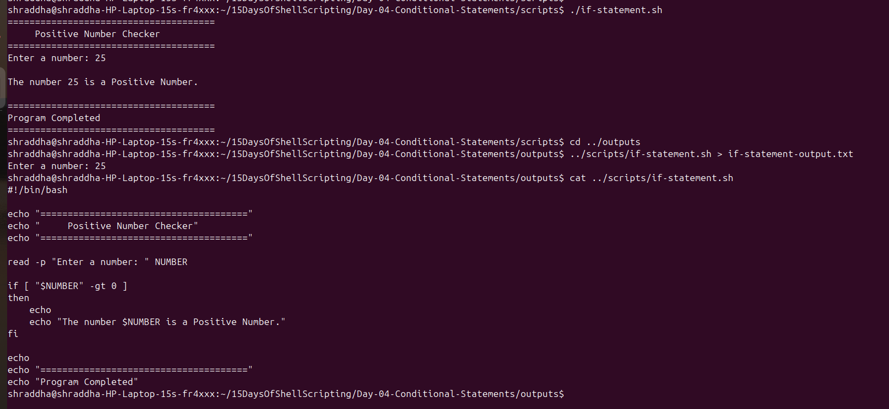
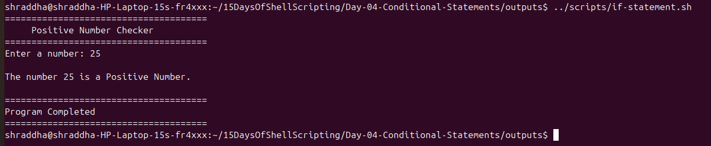
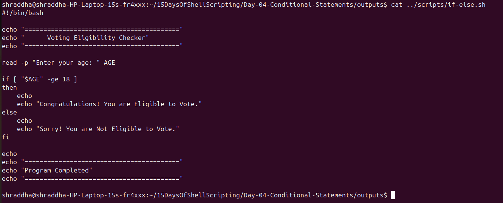
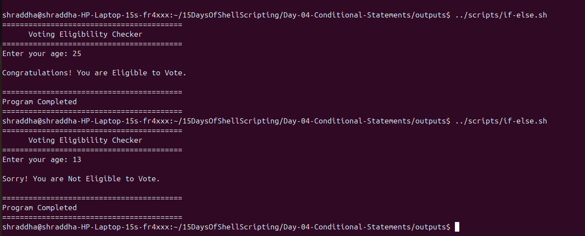
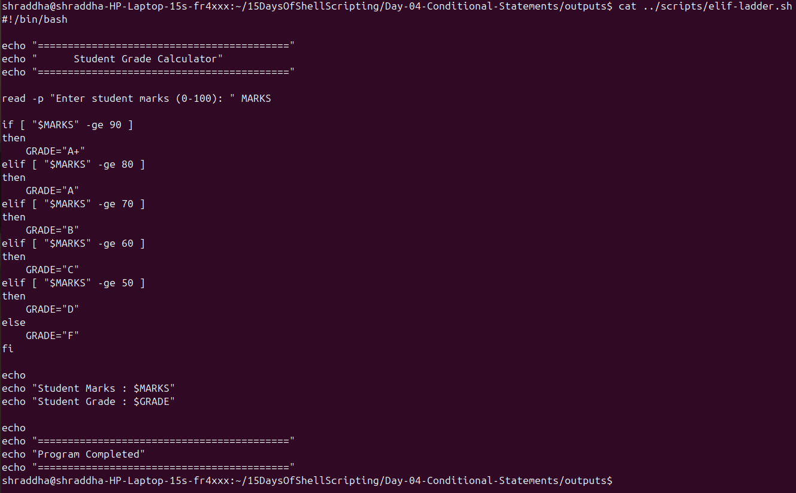
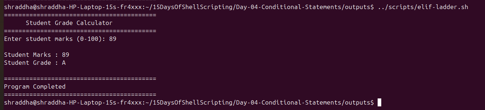
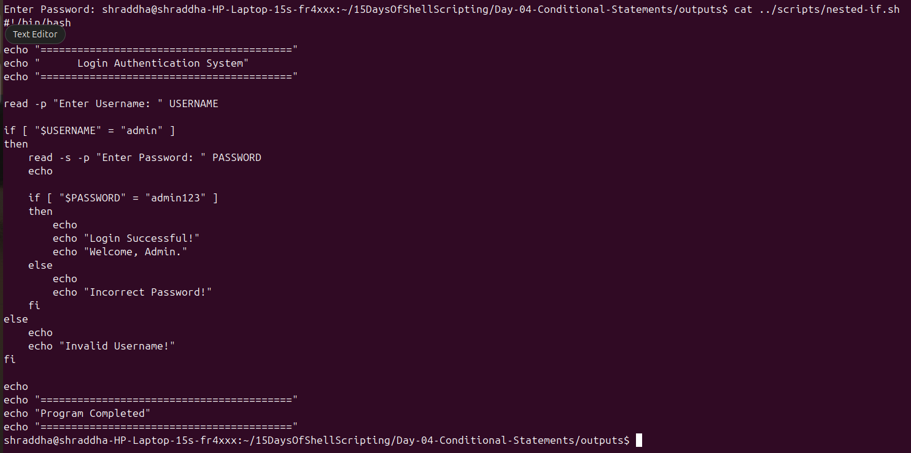
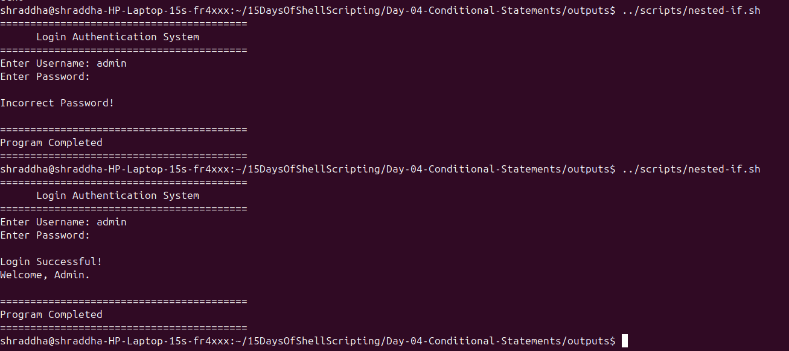
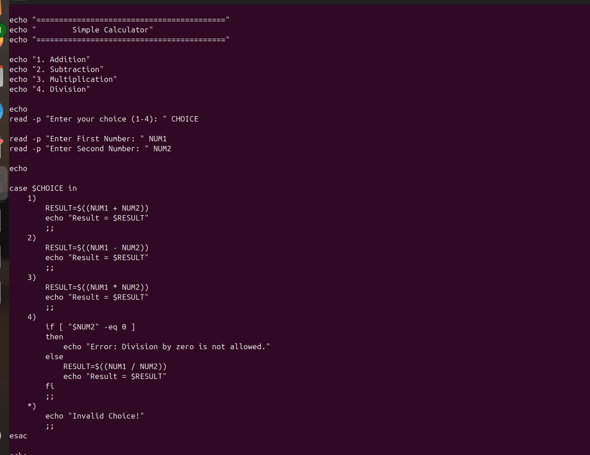
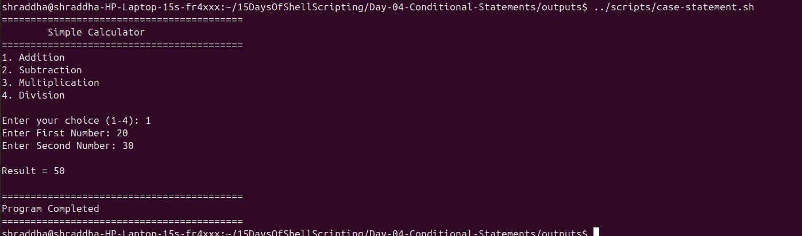

# Exercise 1 – if Statement

## Script

```bash
#!/bin/bash

read -p "Enter your age: " AGE

if [ "$AGE" -ge 18 ]
then
    echo "Eligible to Vote"
fi
```

## Script Screenshot



## Output Screenshot



---

# Exercise 2 – if-else Statement

## Script

```bash
#!/bin/bash

read -p "Enter your age: " AGE

if [ "$AGE" -ge 18 ]
then
    echo "Eligible to Vote"
else
    echo "Not Eligible to Vote"
fi
```

## Script Screenshot



## Output Screenshot



---

# Exercise 3 – elif Ladder

## Script

```bash
#!/bin/bash

read -p "Enter Marks: " MARKS

if [ "$MARKS" -ge 90 ]
then
    echo "Grade A+"
elif [ "$MARKS" -ge 80 ]
then
    echo "Grade A"
elif [ "$MARKS" -ge 70 ]
then
    echo "Grade B"
else
    echo "Grade C"
fi
```

## Script Screenshot



## Output Screenshot



---

# Exercise 4 – Nested if

## Script

```bash
#!/bin/bash

read -p "Username: " USER

read -sp "Password: " PASS
echo

if [ "$USER" = "admin" ]
then
    if [ "$PASS" = "admin123" ]
    then
        echo "Login Successful"
    else
        echo "Wrong Password"
    fi
else
    echo "Invalid User"
fi
```

## Script Screenshot



## Output Screenshot



---

# Exercise 5 – Case Statement

## Script

```bash
#!/bin/bash

echo "1. Date"
echo "2. Current Directory"
echo "3. Logged-in User"

read -p "Enter Choice: " CHOICE

case $CHOICE in
1)
    date
    ;;
2)
    pwd
    ;;
3)
    whoami
    ;;
*)
    echo "Invalid Choice"
    ;;
esac
```

## Script Screenshot



## Output Screenshot


