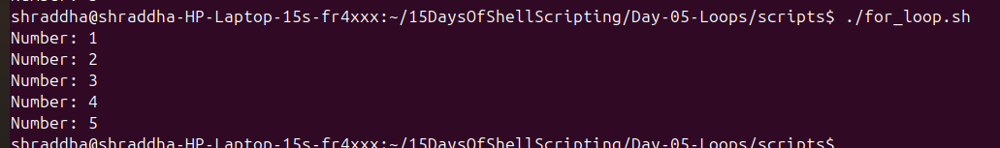
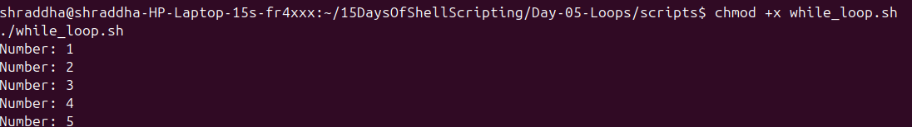
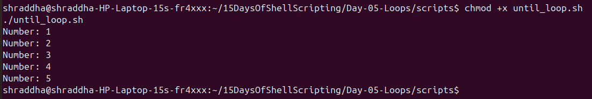
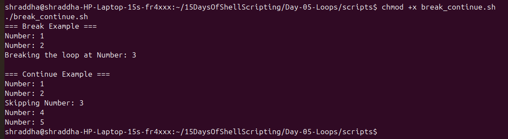
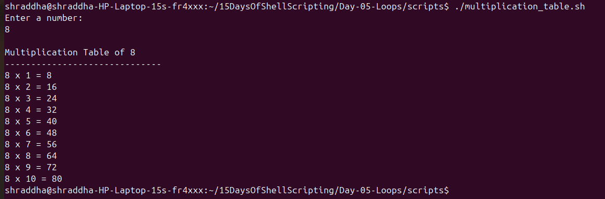
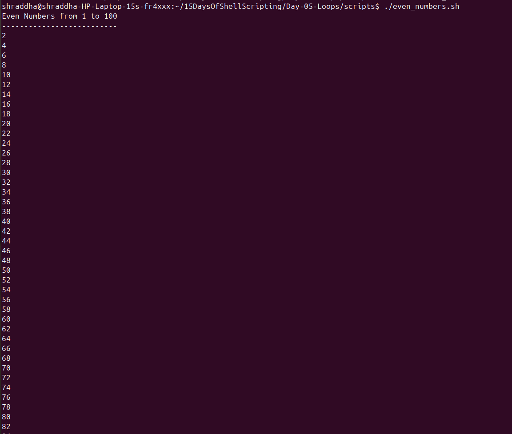
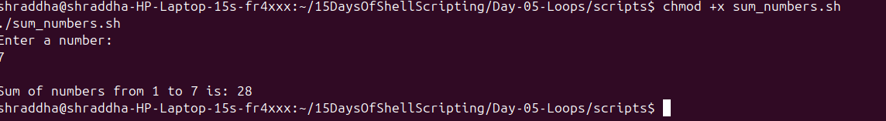
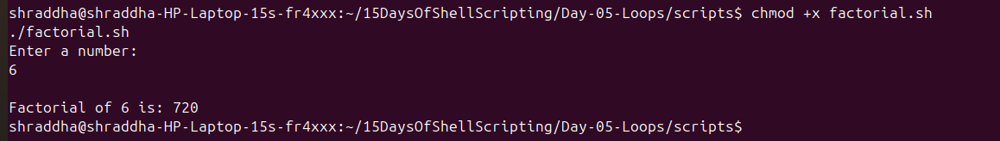

# Day 05 - Bash Loops Practice Exercises

## Exercise 1: For Loop

### Task
Write a Bash script to print numbers using a for loop.

### Script

`for_loop.sh`

### Output

```text
1
2
3
4
5
```

### Screenshot




---

# Exercise 2: While Loop

### Task
Write a Bash script using while loop.

### Script

`while_loop.sh`

### Output

```text
Numbers printed using while loop
```

### Screenshot




---

# Exercise 3: Until Loop

### Task
Write a Bash script using until loop.

### Script

`until_loop.sh`

### Output

```text
Until loop executed successfully
```

### Screenshot




---

# Exercise 4: Break and Continue

### Task
Understand loop control statements.

Concepts:

- break → stops loop
- continue → skips current iteration


### Screenshot




---

# Exercise 5: Multiplication Table

### Task
Create a script to generate multiplication table.

Script:

`multiplication_table.sh`

Example:

```text
5 x 1 = 5
5 x 2 = 10
5 x 3 = 15
```

### Screenshot




---

# Exercise 6: Even Numbers

### Task
Print even numbers using Bash loops.

Script:

`even_numbers.sh`

### Screenshot




---

# Exercise 7: Sum of Numbers

### Task
Calculate sum of numbers using loop.

Script:

`sum_numbers.sh`

### Screenshot




---

# Exercise 8: Factorial Program

### Task
Calculate factorial of a number using for loop.

Script:

`factorial.sh`

Example:

Input:

```text
5
```

Output:

```text
Factorial of 5 is: 120
```

### Screenshot




---

# Day 05 Learning Summary

Today I learned:

✅ for loop  
✅ while loop  
✅ until loop  
✅ break and continue  
✅ arithmetic operations  
✅ user input using read  
✅ solving problems using Bash loops


## Complete Day 05 Screenshots

All script outputs are documented with screenshots for future reference.
