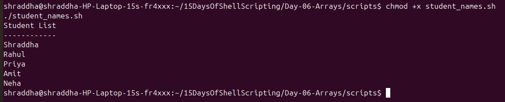
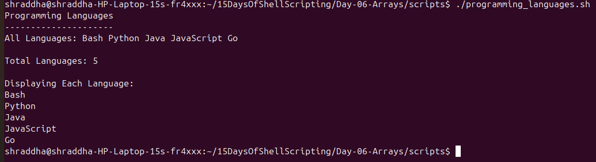
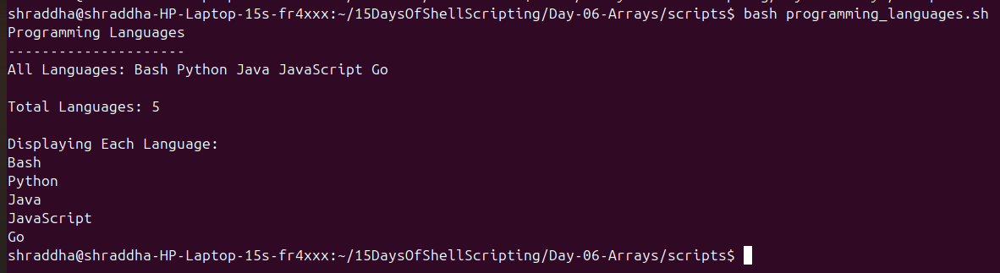

# Day 06 - Bash Arrays Practice Exercises

## Objective

These exercises are designed to strengthen your understanding of Bash arrays.

---

## Exercise 1: Create an Array

**Task:**

Create an array containing five fruit names.

Example:

```bash
fruits=("Apple" "Banana" "Mango" "Orange" "Grapes")
```

**Screenshot:**



---

## Exercise 2: Display All Elements

**Task:**

Print all elements of the array.

Example:

```bash
echo "${fruits[@]}"
```

**Screenshot:**


---

## Exercise 3: Access Individual Elements

**Task:**

Display:

* First element
* Second element
* Third element

Example:

```bash
echo "${fruits[0]}"
echo "${fruits[1]}"
echo "${fruits[2]}"
```

**Screenshot:**


---

## Exercise 4: Find Array Length

**Task:**

Display the total number of elements in the array.

Example:

```bash
echo "${#fruits[@]}"
```

**Screenshot:**


---

## Exercise 5: Loop Through an Array

**Task:**

Use a `for` loop to print every element.

Example:

```bash
for fruit in "${fruits[@]}"
do
    echo "$fruit"
done
```

**Screenshot:**


---

## Exercise 6: Add a New Element

**Task:**

Add `"Pineapple"` to the array.

Example:

```bash
fruits+=("Pineapple")
```

**Screenshot:**


---

## Exercise 7: Update an Element

**Task:**

Replace `"Banana"` with `"Kiwi"`.

Example:

```bash
fruits[1]="Kiwi"
```

**Screenshot:**


---

## Exercise 8: Remove an Element

**Task:**

Remove `"Mango"` from the array.

Example:

```bash
unset fruits[2]
```

**Screenshot:**


---

## Exercise 9: Student Names Project

**Task:**

Create an array of student names and display each name using a `for` loop.

Script:

```text
scripts/student_names.sh
```

**Screenshot:**



---

## Exercise 10: Programming Languages Project

**Task:**

Create an array of programming languages, display all languages, count them, and print each one.

Script:

```text
scripts/programming_languages.sh
```

**Screenshot:**



---

# Summary

By completing these exercises, I practiced:

* Creating arrays
* Accessing array elements
* Printing all elements
* Finding array length
* Looping through arrays
* Adding elements
* Updating elements
* Removing elements
* Building simple Bash projects using arrays
