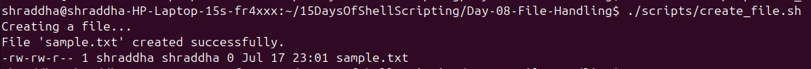
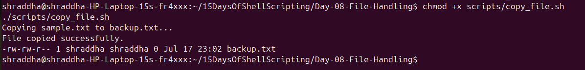
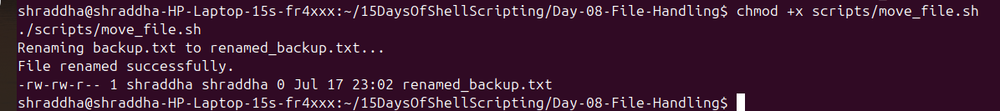
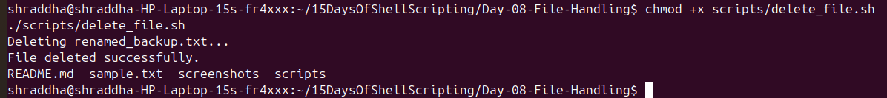
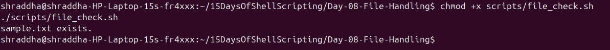
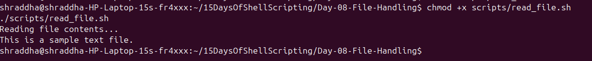

# Day 08 - Practice Exercises

## Exercise 1: Create a File

### Task
Create a Bash script that creates a file named `sample.txt`.

### Script
`scripts/create_file.sh`

### Screenshot

---

## Exercise 2: Copy a File

### Task
Create a Bash script that copies `sample.txt` to `backup.txt`.

### Script
`scripts/copy_file.sh`

### Screenshot

---

## Exercise 3: Move/Rename a File

### Task
Rename `backup.txt` to `renamed_backup.txt`.

### Script
`scripts/move_file.sh`

### Screenshot

---

## Exercise 4: Delete a File

### Task
Delete `renamed_backup.txt`.

### Script
`scripts/delete_file.sh`

### Screenshot

---

## Exercise 5: Check File Existence

### Task
Write a script to check whether `sample.txt` exists.

### Script
`scripts/file_check.sh`

### Screenshot

---

## Exercise 6: Read a File

### Task
Write a script that displays the contents of `sample.txt`.

### Script
`scripts/read_file.sh`

### Screenshot

---

# Practice Challenges

- Create a directory using a Bash script.
- Copy all `.txt` files into another folder.
- Rename multiple files using a loop.
- Delete files older than a specific number of days.
- Display only the first 5 lines of a file.
- Display only the last 5 lines of a file.
- Check whether a file is readable and writable.
- Append text to an existing file.
- Count the number of lines in a file.
- Create a simple backup script using `cp`.
