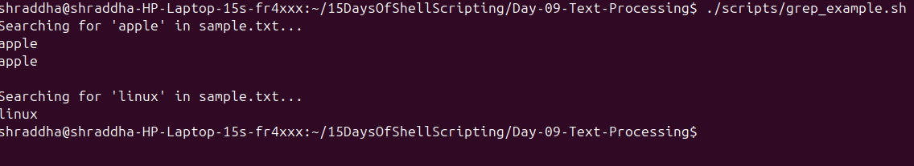
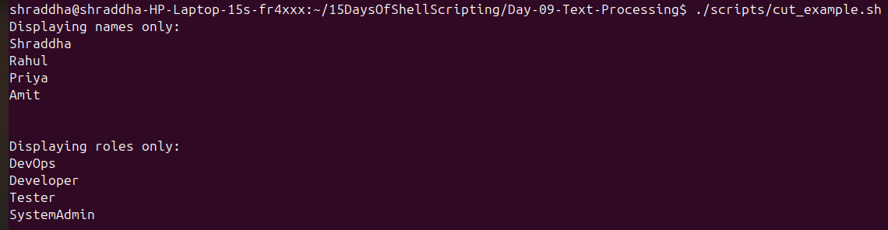
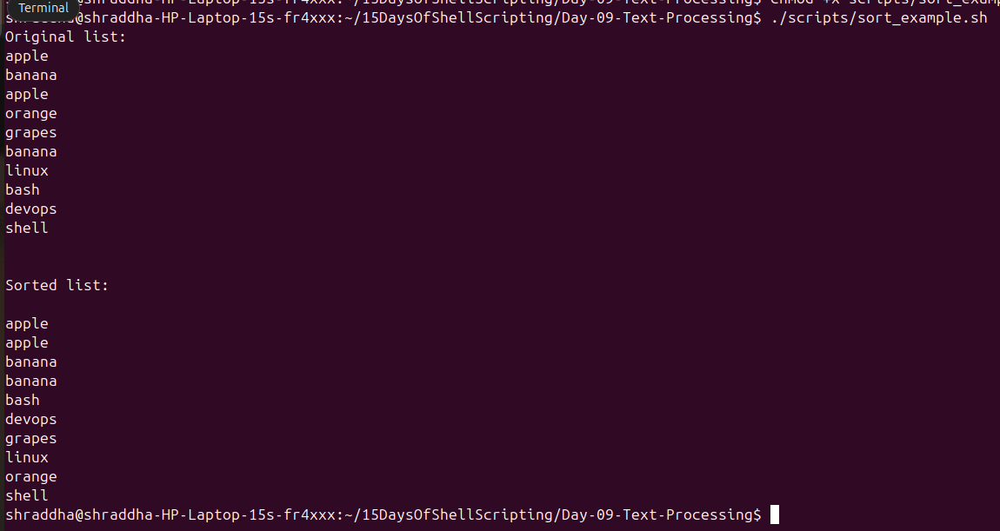
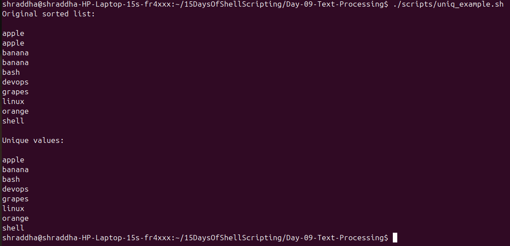
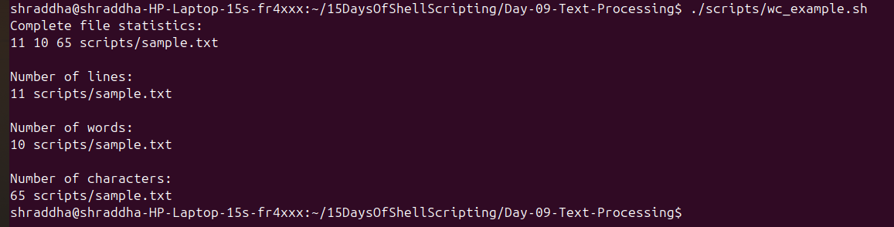
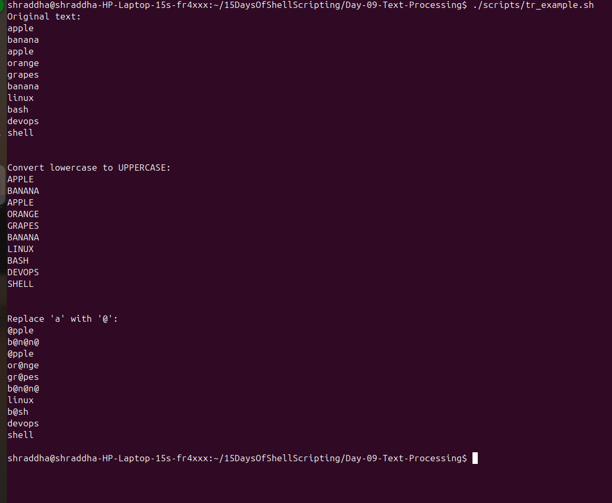

# Day 09 - Practice Exercises

## Exercise 1: Search Text using grep

### Task
Search for the word **apple** in `sample.txt`.

### Script

`scripts/grep_example.sh`

### Screenshot

---

## Exercise 2: Extract Fields using cut

### Task
Display only the usernames from `users.txt`.

### Script

`scripts/cut_example.sh`

### Screenshot

---

## Exercise 3: Sort Text

### Task
Sort the contents of `sample.txt` alphabetically.

### Script

`scripts/sort_example.sh`

### Screenshot

---

## Exercise 4: Remove Duplicate Lines

### Task
Display only unique values from `sample.txt`.

### Script

`scripts/uniq_example.sh`

### Screenshot

---

## Exercise 5: Count Lines, Words, and Characters

### Task
Display the number of lines, words, and characters in `sample.txt`.

### Script

`scripts/wc_example.sh`

### Screenshot

---

## Exercise 6: Transform Text using tr

### Task
Convert lowercase text to uppercase and replace the character **a** with **@**.

### Script

`scripts/tr_example.sh`

### Screenshot

---

# Practice Challenges

1. Search for the word **banana** in `sample.txt`.
2. Display only the second field from `users.txt`.
3. Sort a list of numbers in ascending order.
4. Count the number of words in a text file.
5. Convert uppercase letters to lowercase using `tr`.
6. Remove duplicate names from a file.
7. Count how many times the word **apple** appears.
8. Combine `grep` and `wc` to count matching lines.
9. Use `cut` to extract data from a CSV file.
10. Use `sort`, `uniq`, and `wc` together to count unique values.

---

# Bonus Challenge

Create a Bash script that:

- Searches for a word entered by the user.
- Counts how many matching lines are found.
- Displays the matching lines.
- Converts the matching output to uppercase.

**Hint:** Use `grep`, `wc`, `tr`, and pipes (`|`).

